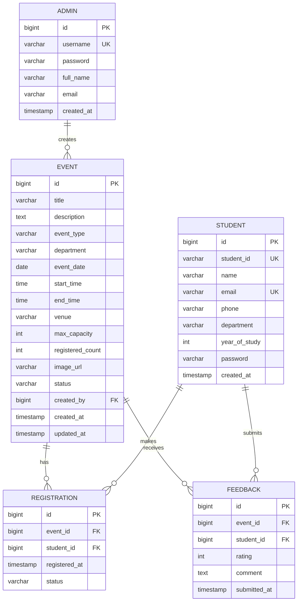

# 🎓 Smart Campus Event Management System — Implementation Plan

> **Status:** Planning Phase | **Target:** Prototyping (fully functional, local use)

---

## 1. Tech Stack Overview

| Layer | Technology | Purpose |
|-------|-----------|---------|
| **Backend** | Java 17 + Spring Boot 3.x | REST APIs, MVC, Business Logic |
| **ORM** | Spring Data JPA (Hibernate) | Entity mapping, CRUD, Queries |
| **Security** | Spring Security | Admin authentication (Basic Auth → JWT later) |
| **Validation** | Jakarta Bean Validation | `@NotNull`, `@Size`, `@Email` on DTOs |
| **Exception Handling** | `@ControllerAdvice` | Global error responses |
| **Database** | MySQL 8.x (Local) | Persistent storage |
| **Frontend** | React 18 + Vite | SPA with modern tooling |
| **State Mgmt** | Redux Toolkit | Global state, async thunks for API |
| **Styling** | Tailwind CSS 3.x | Utility-first responsive design |
| **Icons/UI** | Lucide React, Headless UI | Icons, modals, dropdowns |
| **HTTP Client** | Axios | API communication |
| **Build Tool** | Maven | Backend dependency management |
| **Server** | Embedded Tomcat (Spring Boot) | No external server needed |

> [!NOTE]
> **Thymeleaf** is dropped in favor of a pure **React SPA** frontend. React communicates with Spring Boot via REST APIs. This is cleaner for a modern full-stack app.

---

## 2. Project Structure

```
c:\Users\surya\Desktop\Soumitra\
├── backend/                          # Spring Boot Application
│   ├── pom.xml
│   └── src/
│       └── main/
│           ├── java/com/campus/events/
│           │   ├── CampusEventsApplication.java
│           │   ├── config/
│           │   │   ├── SecurityConfig.java
│           │   │   ├── CorsConfig.java
│           │   │   └── AppConfig.java
│           │   ├── controller/
│           │   │   ├── EventController.java        # REST endpoints
│           │   │   ├── RegistrationController.java
│           │   │   ├── AuthController.java
│           │   │   ├── FeedbackController.java
│           │   │   └── StatsController.java
│           │   ├── dto/
│           │   │   ├── EventDTO.java
│           │   │   ├── RegistrationDTO.java
│           │   │   ├── FeedbackDTO.java
│           │   │   ├── LoginRequest.java
│           │   │   └── ApiResponse.java
│           │   ├── entity/
│           │   │   ├── Event.java
│           │   │   ├── Student.java
│           │   │   ├── Registration.java
│           │   │   ├── Feedback.java
│           │   │   └── Admin.java
│           │   ├── repository/
│           │   │   ├── EventRepository.java
│           │   │   ├── StudentRepository.java
│           │   │   ├── RegistrationRepository.java
│           │   │   └── FeedbackRepository.java
│           │   ├── service/
│           │   │   ├── EventService.java
│           │   │   ├── RegistrationService.java
│           │   │   ├── FeedbackService.java
│           │   │   └── StatsService.java
│           │   └── exception/
│           │       ├── GlobalExceptionHandler.java
│           │       ├── ResourceNotFoundException.java
│           │       └── DuplicateRegistrationException.java
│           └── resources/
│               ├── application.properties
│               └── data.sql                        # Seed data
│
└── frontend/                         # React + Vite App
    ├── package.json
    ├── vite.config.js
    ├── tailwind.config.js
    ├── index.html
    └── src/
        ├── main.jsx
        ├── App.jsx
        ├── api/
        │   └── axiosClient.js
        ├── store/
        │   ├── store.js
        │   ├── eventSlice.js
        │   ├── authSlice.js
        │   └── registrationSlice.js
        ├── pages/
        │   ├── HomePage.jsx
        │   ├── EventDetailsPage.jsx
        │   ├── MyRegistrationsPage.jsx
        │   ├── LoginPage.jsx
        │   └── admin/
        │       ├── DashboardPage.jsx
        │       ├── ManageEventsPage.jsx
        │       └── EventStatsPage.jsx
        ├── components/
        │   ├── layout/
        │   │   ├── Navbar.jsx
        │   │   ├── Footer.jsx
        │   │   └── Sidebar.jsx
        │   ├── events/
        │   │   ├── EventCard.jsx
        │   │   ├── EventGrid.jsx
        │   │   ├── EventForm.jsx
        │   │   └── EventFilters.jsx
        │   ├── ui/
        │   │   ├── Modal.jsx
        │   │   ├── Button.jsx
        │   │   ├── Input.jsx
        │   │   ├── Badge.jsx
        │   │   ├── Toast.jsx
        │   │   └── LoadingSpinner.jsx
        │   └── feedback/
        │       ├── FeedbackForm.jsx
        │       └── StarRating.jsx
        └── utils/
            ├── constants.js
            └── helpers.js
```

---

## 3. Database Schema

### 3.1 ER Diagram



### 3.2 Table Details

**events**
| Column | Type | Constraints |
|--------|------|-------------|
| id | BIGINT | PK, AUTO_INCREMENT |
| title | VARCHAR(200) | NOT NULL |
| description | TEXT | NOT NULL |
| event_type | ENUM('WORKSHOP','SEMINAR','HACKATHON','CULTURAL','SPORTS','GUEST_LECTURE') | NOT NULL |
| department | VARCHAR(100) | NOT NULL |
| event_date | DATE | NOT NULL |
| start_time | TIME | NOT NULL |
| end_time | TIME | NOT NULL |
| venue | VARCHAR(200) | NOT NULL |
| max_capacity | INT | NOT NULL, DEFAULT 100 |
| registered_count | INT | DEFAULT 0 |
| image_url | VARCHAR(500) | NULLABLE |
| status | ENUM('UPCOMING','ONGOING','COMPLETED','CANCELLED') | DEFAULT 'UPCOMING' |
| created_by | BIGINT | FK → admins.id |
| created_at | TIMESTAMP | DEFAULT CURRENT_TIMESTAMP |
| updated_at | TIMESTAMP | ON UPDATE CURRENT_TIMESTAMP |

**students** — `student_id` and `email` are UNIQUE.

**registrations** — Composite UNIQUE on `(event_id, student_id)` to prevent duplicate registration.

**feedback** — Composite UNIQUE on `(event_id, student_id)` (one feedback per event per student). `rating` CHECK 1–5.

---

## 4. API Design

### 4.1 Public / Student APIs

| Method | Endpoint | Description |
|--------|----------|-------------|
| GET | `/api/events` | List all events (with filters: date, dept, type, status) |
| GET | `/api/events/{id}` | Get event details |
| POST | `/api/students/register` | Student self-registration (create account) |
| POST | `/api/auth/student/login` | Student login |
| POST | `/api/registrations` | Register for an event |
| GET | `/api/registrations/my` | Get student's registered events |
| DELETE | `/api/registrations/{id}` | Cancel registration |
| POST | `/api/feedback` | Submit feedback for a completed event |
| GET | `/api/events/{id}/feedback` | View feedback for an event |

### 4.2 Admin APIs (Authenticated)

| Method | Endpoint | Description |
|--------|----------|-------------|
| POST | `/api/auth/admin/login` | Admin login |
| POST | `/api/admin/events` | Create event |
| PUT | `/api/admin/events/{id}` | Update event |
| DELETE | `/api/admin/events/{id}` | Delete event |
| GET | `/api/admin/events/{id}/registrations` | View registrations for event |
| GET | `/api/admin/stats/overview` | Dashboard stats (total events, registrations, etc.) |
| GET | `/api/admin/stats/events/{id}` | Stats for specific event |
| GET | `/api/admin/stats/department` | Stats grouped by department |

### 4.3 Query Filters (GET `/api/events`)

```
?department=CSE&eventType=WORKSHOP&dateFrom=2026-05-01&dateTo=2026-06-01&status=UPCOMING&page=0&size=10&sort=eventDate,asc
```

### 4.4 Response Format

```json
{
  "success": true,
  "message": "Events fetched successfully",
  "data": { ... },
  "timestamp": "2026-04-23T19:00:00"
}
```

Error response:
```json
{
  "success": false,
  "message": "Event not found with id: 5",
  "errorCode": "RESOURCE_NOT_FOUND",
  "timestamp": "2026-04-23T19:00:00"
}
```

---

## 5. Spring Boot Technical Highlights

### 5.1 Dependency Injection
- All services injected via `@Autowired` (constructor injection preferred)
- `@Configuration` classes for beans like `PasswordEncoder`, `ModelMapper`

### 5.2 Spring MVC
- `@RestController` for all API controllers
- `@RequestMapping("/api/...")` base paths
- `@GetMapping`, `@PostMapping`, `@PutMapping`, `@DeleteMapping`
- `@RequestBody`, `@PathVariable`, `@RequestParam` for binding

### 5.3 Spring Data JPA
- Entities: `@Entity`, `@Table`, `@Id`, `@GeneratedValue`
- Relationships: `@ManyToOne`, `@OneToMany` with `@JoinColumn`
- Custom queries: `@Query` with JPQL for aggregate stats
- Pagination: `Pageable` and `Page<Event>`

### 5.4 Validation
```java
// On DTO fields:
@NotNull(message = "Title is required")
@Size(min = 5, max = 200, message = "Title must be 5-200 characters")
private String title;

@NotNull @FutureOrPresent
private LocalDate eventDate;
```

### 5.5 Security (Prototype Phase)
- **Basic Auth** for admin endpoints using Spring Security
- Admin credentials stored in DB with `BCryptPasswordEncoder`
- Students use simple token-based session (stored in localStorage)
- CORS configured for `http://localhost:5173` (Vite dev server)
- In production: migrate to **JWT tokens**

### 5.6 Exception Handling
```java
@ControllerAdvice
public class GlobalExceptionHandler {
    @ExceptionHandler(ResourceNotFoundException.class)  → 404
    @ExceptionHandler(DuplicateRegistrationException.class)  → 409
    @ExceptionHandler(MethodArgumentNotValidException.class)  → 400
    @ExceptionHandler(AccessDeniedException.class)  → 403
    @ExceptionHandler(Exception.class)  → 500
}
```

---

## 6. Frontend Architecture

### 6.1 Routing (React Router v6)

| Path | Page | Access |
|------|------|--------|
| `/` | HomePage (event listing) | Public |
| `/events/:id` | EventDetailsPage | Public |
| `/login` | LoginPage (student + admin tabs) | Public |
| `/my-registrations` | MyRegistrationsPage | Student |
| `/admin/dashboard` | Admin Dashboard | Admin |
| `/admin/events` | Manage Events (CRUD) | Admin |
| `/admin/events/:id/stats` | Event Statistics | Admin |

### 6.2 Redux Toolkit Slices

- **`authSlice`** — login state, user role, token
- **`eventSlice`** — events list, filters, CRUD status
- **`registrationSlice`** — student registrations
- **`feedbackSlice`** — feedback submissions

Each slice uses `createAsyncThunk` for API calls via Axios.

### 6.3 Key UI Components

| Component | Description |
|-----------|-------------|
| `EventCard` | Gradient card with image, date badge, type pill, register button |
| `EventGrid` | Responsive grid with filter bar |
| `EventFilters` | Dropdowns for department, type, date range |
| `EventForm` | Modal form for create/edit with validation |
| `Modal` | Reusable overlay modal (Headless UI) |
| `FeedbackForm` | Star rating + comment textarea |
| `StatsChart` | Registration stats with bar/pie charts |
| `Navbar` | Responsive nav with auth-aware menu |
| `Toast` | Success/error notification popups |

### 6.4 Design Theme

- **Color Palette:** Deep indigo (`#4F46E5`) primary, violet accents, slate backgrounds
- **Dark/Light:** Light mode default, dark mode toggle
- **Cards:** Glassmorphism with subtle backdrop blur
- **Animations:** Framer Motion for page transitions, card hovers
- **Typography:** Google Font — **Inter** (clean, modern)
- **Gradients:** Indigo → Violet for headers and hero sections

---

## 7. Prerequisites & Local Setup

### 7.1 Software Required

| Software | Version | Purpose |
|----------|---------|---------|
| JDK | 17+ | Java runtime |
| Maven | 3.8+ | Backend build tool |
| Node.js | 18+ | Frontend runtime |
| npm | 9+ | Package manager |
| MySQL | 8.x | Database |
| VS Code / IntelliJ | Latest | IDE |
| Git | Latest | Version control |

### 7.2 MySQL Setup (When Ready)

```sql
-- Run in MySQL CLI or Workbench:
CREATE DATABASE campus_events;
CREATE USER 'campus_admin'@'localhost' IDENTIFIED BY 'campus123';
GRANT ALL PRIVILEGES ON campus_events.* TO 'campus_admin'@'localhost';
FLUSH PRIVILEGES;
```

**application.properties:**
```properties
spring.datasource.url=jdbc:mysql://localhost:3306/campus_events
spring.datasource.username=campus_admin
spring.datasource.password=campus123
spring.jpa.hibernate.ddl-auto=update
spring.jpa.show-sql=true
spring.jpa.properties.hibernate.dialect=org.hibernate.dialect.MySQLDialect
```

---

## 8. Development Phases

### Phase 1 — Backend Foundation ⏱️ ~2 hours
1. Initialize Spring Boot project (Spring Initializr / Maven)
2. Configure MySQL connection + JPA
3. Create all entity classes with JPA annotations
4. Create repositories with custom queries
5. Implement services with business logic
6. Seed initial data (`data.sql`)

### Phase 2 — REST APIs ⏱️ ~2 hours
1. Build all REST controllers
2. Add DTO layer with validation annotations
3. Implement global exception handler
4. Add pagination & sorting support
5. Test all endpoints (can use browser/Postman)

### Phase 3 — Security ⏱️ ~1 hour
1. Configure Spring Security with Basic Auth
2. Set up CORS for frontend dev server
3. Role-based endpoint access (ADMIN vs STUDENT)
4. Password encoding with BCrypt

### Phase 4 — UI/UX Design (Stitch) ⏱️ ~1 hour
1. Design all screens in Stitch
2. Finalize color palette, typography, layout
3. Export design tokens for Tailwind config

### Phase 5 — Frontend Build ⏱️ ~3 hours
1. Scaffold React + Vite project
2. Set up Tailwind CSS, React Router, Redux Toolkit
3. Build all pages and components
4. Connect to backend APIs via Axios
5. Implement form validation (client-side)

### Phase 6 — Integration & Polish ⏱️ ~1 hour
1. End-to-end testing of all flows
2. Add loading states, error handling, toasts
3. Responsive design QA
4. Add micro-animations (Framer Motion)

---

## 9. Key Aggregate Queries (Stats)

```sql
-- Total registrations per event
SELECT e.title, COUNT(r.id) FROM events e LEFT JOIN registrations r ON e.id = r.event_id GROUP BY e.id;

-- Department-wise event count
SELECT department, COUNT(*) FROM events GROUP BY department;

-- Most popular events (by registration count)
SELECT title, registered_count FROM events ORDER BY registered_count DESC LIMIT 5;

-- Average feedback rating per event
SELECT e.title, AVG(f.rating) FROM events e JOIN feedback f ON e.id = f.event_id GROUP BY e.id;
```

These will be implemented as `@Query` methods in JPA repositories.

---

## 10. Next Steps

| Step | Action |
|------|--------|
| ✅ 1 | **Review this plan** — Confirm tech stack, schema, features |
| ⬜ 2 | **UI/UX Design** — Design all screens using Stitch Loop |
| ⬜ 3 | **MySQL Setup** — Create database on your local MySQL |
| ⬜ 4 | **Backend Coding** — Spring Boot project implementation |
| ⬜ 5 | **Frontend Coding** — React app implementation |
| ⬜ 6 | **Integration & Testing** — End-to-end validation |

> [!IMPORTANT]
> **Your input needed:** Please review this plan and confirm:
> 1. Are you happy with the tech stack? (React SPA instead of Thymeleaf)
> 2. Any additional features or entities to add?
> 3. Which Java IDE do you prefer? (IntelliJ / VS Code / Eclipse)
> 4. Do you have JDK 17+, Maven, and Node.js installed?
> 5. Ready to proceed to UI/UX design phase?
